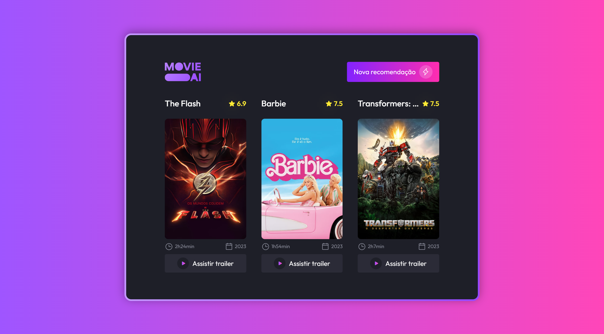

<h1 align="center"> Movie - AI </h1>

[Click here to access](https://movie-ai.vercel.app/)

## 🚀 Technologies

This project was developed with the follow technologies:

- [React.js](https://react.dev/)
- [Typescript](https://www.typescriptlang.org/)
- [Tailwind CSS](https://tailwindcss.com/)
- [TMDb API](https://developer.themoviedb.org/docs)
- Git and GitHub

## 💻 Project

The "Movie - AI" project is an interface that simulates the generation of recommended movies by AI (Artificial Intelligence).  

Main features:

- Responsive layout (Adapted for smaller screens);
- Dynamic data;
- Hover effects;
- loading animation/Entry.